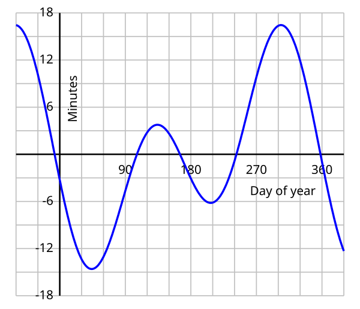
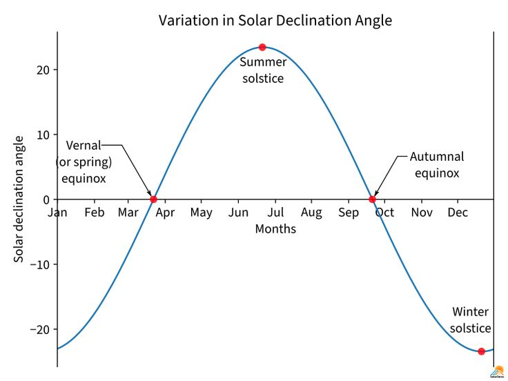
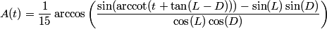

# Islamic Prayer Times App

## Overview

This iOS app, written in Swift, calculates and displays Islamic prayer times based on the user's location. It provides accurate timings for the five daily prayers: Fajr, Dhuhr, Asr, Maghrib, and Isha, as well as sunrise and sunset times.

Credit goes to [PrayTimes](http://praytimes.org/calculation) if you want to understand how these are calculated.

## Prayer Time Calculations

### 1. Equation of Time (EoT)



### 2. Sun's Declination



### 3. User's Geographical Location

- Latitude: Affects the sun's altitude and the duration of twilight
- Longitude: Determines the local time relative to UTC

#### Dhuhr (Noon Prayer)

```
Dhuhr = 12 + TimeZone - Lng/15 - EqT
```

Where:
- `TimeZone` is the local time zone offset from UTC
- `Lng` is the longitude in degrees
- `EqT` is the equation of time in hours

#### Sunrise and Sunset


```
Sunrise = Dhuhr - T(0.833)
Sunset = Dhuhr + T(0.833)
```

#### Fajr and Isha

The angles used for Fajr and Isha calculations vary by convention:

| Convention | Fajr Angle | Isha Angle |
|------------|------------|------------|
| Muslim World League | 18° | 17° |
| Islamic Society of North America (ISNA) | 15° | 15° |
| Egyptian General Authority of Survey | 19.5° | 17.5° |
| Umm al-Qura University, Makkah | 18.5° | 90 min after Maghrib<br>120 min during Ramadan |
| University of Islamic Sciences, Karachi | 18° | 18° |
| Institute of Geophysics, University of Tehran | 17.7° | 14°* |
| Shia Ithna Ashari, Leva Research Institute, Qum | 16° | 14° |

```
Fajr = Dhuhr - T(FajrAngle)
Isha = Dhuhr + T(IshaAngle)
```

#### Asr (Afternoon Prayer)



- Four Schools of Thought: `Asr = Dhuhr + A(1)`
- Hanafi: `Asr = Dhuhr + A(2)`

#### Maghrib (Sunset Prayer)

Maghrib is typically calculated as the sunset time with a small buffer:

```
Maghrib = Sunset + 1 to 3 minutes
```

## Credits

This app's prayer time calculations are based on the calculations and information provided by [PrayTimes.org](http://praytimes.org/). I am grateful for their comprehensive documentation on Islamic prayer time computation methods.
As well as:
- The Determination of Salat Times, by Dr. Monzur Ahmed.
- Approximate Solar Coordinates, by U.S. Naval Observatory.
- The Islamic Prayer Times, by Professor Tariq Muneer.

## Disclaimer

Users are encouraged to verify times with their local mosque or religious authority. This was just a side project.